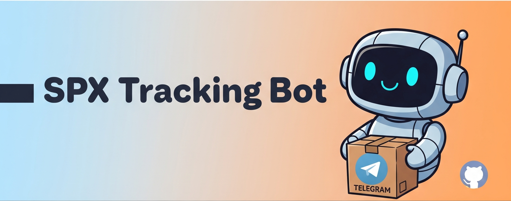

<p align="center">
  
</p>

<h1 align="center">🤖 SPX Tracking Bot - Telegram 📦</h1>

<p align="center">
  Một chatbot Telegram giúp bạn theo dõi đơn hàng Shopee Express (SPX) một cách tự động và tiện lợi. Không còn phải mở ứng dụng và gõ mã vận đơn mỗi ngày!
</p>

<p align="center">
  
  
  
  
</p>

---

## 🎯 Giới thiệu

Dự án này được sinh ra từ nhu cầu theo dõi các đơn hàng Shopee một cách tự động. Thay vì phải truy cập trang web `spx.vn` mỗi ngày, con bot này sẽ làm điều đó giúp bạn. Nó sẽ tự động kiểm tra và gửi thông báo đến Telegram của bạn ngay khi có trạng thái vận chuyển mới, giúp bạn tiết kiệm thời gian và luôn cập nhật về hành trình đơn hàng.

---

## ✨ Tính năng chính

* ✅ **Theo dõi tự động:** Bot sẽ kiểm tra định kỳ các mã vận đơn bạn đã đăng ký.
* 🔔 **Thông báo tức thì:** Gửi thông báo ngay khi có cập nhật trạng thái mới.
* 📜 **Xem lịch sử đầy đủ:** Lệnh `/history` cho phép xem toàn bộ hành trình của đơn hàng từ lúc tạo đến khi giao.
* 📈 **Tra cứu trạng thái nhanh:** Kiểm tra trạng thái mới nhất của bất kỳ đơn hàng nào với lệnh `/status`.
* 🗑️ **Quản lý danh sách tiện lợi:** Dễ dàng thêm (`/track`), xóa (`/untrack`), và xem danh sách (`/list`) các đơn hàng đang theo dõi.
* 🎉 **Tự động dọn dẹp:** Bot sẽ tự động ngừng theo dõi và thông báo cho bạn khi đơn hàng đã được giao thành công.

---

## 🛠️ Công nghệ sử dụng

* **Ngôn ngữ:** 🐍 Python 3.10+
* **Thư viện Telegram:** 🤖 `python-telegram-bot`
* **Cơ sở dữ liệu:** 🗃️ SQLite
* **Gọi API:** 🌐 `requests`

---

## 🚀 Cài đặt và Khởi chạy

Làm theo các bước sau để khởi chạy bot trên máy của bạn hoặc trên server.

### **1. Yêu cầu**

* **Python 3.10** trở lên.
* Một **Token của Telegram Bot**. Bạn có thể lấy nó từ [BotFather](https://t.me/BotFather).

### **2. Các bước cài đặt**

1.  **Clone repository về máy:**
    ```bash
    git clone https://github.com/giangcse/spx_tracking
    cd spx_tracking
    ```

2.  **Tạo và kích hoạt môi trường ảo** (khuyến khích):
    * Trên macOS/Linux:
        ```bash
        python3 -m venv .venv
        source .venv/bin/activate
        ```
    * Trên Windows:
        ```bash
        python -m venv .venv
        .venv\Scripts\activate
        ```

3.  **Cài đặt các thư viện cần thiết:**
    ```bash
    pip install -r requirements.txt
    ```
    *(Nếu bạn chưa có file `requirements.txt`, hãy tạo nó với nội dung bên dưới)*

4.  **Cấu hình Bot Token:**
    * Tạo file `.env`.
    * Dán **Bot Token** của bạn vào biến `BOT_TOKEN`.
        ```python
        # .env
        BOT_TOKEN = "123456:ABC-DEF1234ghIkl-zyx57W2v1u123ew11" # Thay bằng token của bạn
        ```

5.  **Chạy bot!**
    ```bash
    python main.py
    ```
    Bot của bạn bây giờ đã sẵn sàng hoạt động.

---

## 📖 Cách sử dụng

Sau khi khởi chạy bot, bạn có thể tương tác với nó trên Telegram bằng các lệnh sau:

* `/start` - Hiển thị tin nhắn chào mừng và danh sách lệnh.
* `/track <mã_vận_đơn>` - Bắt đầu theo dõi một mã vận đơn mới.
* `/untrack <mã_vận_đön>` - Ngừng theo dõi một mã vận đơn.
* `/status <mã_vận_đơn>` - Xem trạng thái mới nhất của một mã vận đơn.
* `/history <mã_vận_đơn>` - Xem toàn bộ lộ trình của một mã vận đơn.
* `/list` - Liệt kê tất cả các mã bạn đang theo dõi.

---

## 📁 Cấu trúc thư mục
```

spx\_tracker\_bot/
├── .venv/                  \# Thư mục môi trường ảo
├── main.py                 \# File chính để chạy bot
├── config.py               \# Lưu trữ token và các cấu hình
├── database.py             \# Quản lý mọi thứ về database
├── spx\_service.py          \# Xử lý logic riêng của SPX (gọi API, định dạng)
└── bot\_handlers.py         \# Chứa các hàm xử lý lệnh của bot

```

---

## ⚙️ Chạy bot như một Service trên Linux (Production)

Để đảm bảo bot hoạt động 24/7 và tự động khởi động lại khi server reboot, bạn nên chạy nó như một service của `systemd`.

### **1. Tạo file Service**

Tạo một file service mới bằng trình soạn thảo yêu thích của bạn (ví dụ: `nano`):

```bash
sudo nano /etc/systemd/system/spx_bot.service
````

### **2. Dán nội dung vào file Service**

Dán toàn bộ nội dung dưới đây vào file bạn vừa tạo.

**Lưu ý:** Bạn cần thay đổi `your_username` và `/path/to/your/project` cho phù hợp với hệ thống của bạn.

```ini
[Unit]
Description=SPX Tracking Telegram Bot
After=network.target

[Service]
# Thay "your_username" bằng username bạn dùng để chạy bot
User=your_username
Group=your_username

# Thay "/path/to/your/project" bằng đường dẫn tuyệt đối đến thư mục dự án
WorkingDirectory=/path/to/your/project
ExecStart=/path/to/your/project/.venv/bin/python main.py

Restart=on-failure
RestartSec=5s

[Install]
WantedBy=multi-user.target
```

**Cách tìm đường dẫn chính xác:**

  * Để tìm `WorkingDirectory`, đi tới thư mục dự án và gõ lệnh `pwd`.
  * Để tìm `ExecStart`, đi tới thư mục dự án, kích hoạt môi trường ảo (`source .venv/bin/activate`) và gõ lệnh `which python`.

### **3. Quản lý Service**

Sau khi đã lưu file, hãy sử dụng các lệnh sau để quản lý service của bạn:

1.  **Tải lại `systemd` để nhận diện service mới:**

    ```bash
    sudo systemctl daemon-reload
    ```

2.  **Kích hoạt service để tự chạy khi khởi động:**

    ```bash
    sudo systemctl enable spx_bot.service
    ```

3.  **Bắt đầu service ngay lập tức:**

    ```bash
    sudo systemctl start spx_bot.service
    ```

4.  **Kiểm tra trạng thái của service:**

    ```bash
    sudo systemctl status spx_bot.service
    ```

    (Nhấn `q` để thoát)

5.  **Xem logs (nhật ký) của bot:**
    Lệnh này rất hữu ích để debug lỗi.

    ```bash
    journalctl -u spx_bot -f
    ```

    (Nhấn `Ctrl + C` để thoát)

Bây giờ bot của bạn đã chạy như một tiến trình nền ổn định trên server.
---

## 📄 Giấy phép

Dự án này được cấp phép theo **MIT License**. Xem file `LICENSE` để biết thêm chi tiết.
